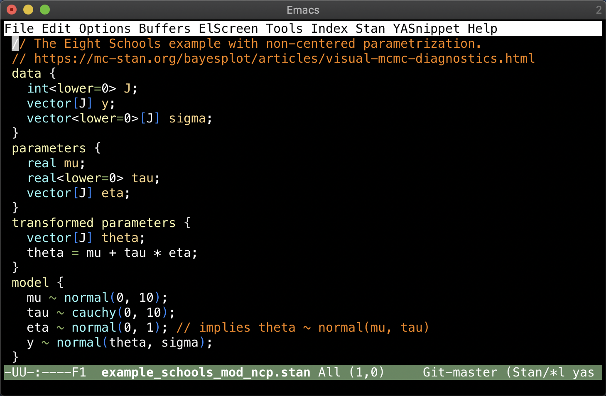

# Emacs major mode for Stan

[](https://melpa.org/#/stan-mode)
[](https://stable.melpa.org/#/stan-mode)



`stan-mode` an Emacs meajor mode for editing [Stan](https://mc-stan.org) program files. Its current features include:
  - syntax highlighting
  - indentation
  - [imenu](https://www.emacswiki.org/emacs/ImenuMode) support for blocks, variables, and user-defined functions.


## Installation
Install this package using the built-in package manager: `package.el`. `stan-mode` is available from [MELPA](https://melpa.org). If you're not already using MELPA, follow its [installation instructions](https://melpa.org/#/getting-started).

You can then install it using the following command:

<kbd>M-x package-install [RET] stan-mode [RET]</kbd>


## Configuration
An example configuration using the [`use-package`](https://github.com/jwiegley/use-package) macro is the following. `stan-handle-deprecated-comments` is nil by default, which gives better highlighting of the `#include` statements. Indenting breaks with # comments, which should be changed to //. If you need to work on legacy files with # line comments, you may need to set this to t.

```{lisp}
(use-package stan-mode
  :mode ("\\.stan\\'" . stan-mode)
  :hook (stan-mode . stan-mode-setup)
  ;;
  :config
  (setq stan-indentation-offset 2))
```

It can also be written as follows.

```{lisp}
(require 'stan-mode)
;; Add a hook to setup `stan-mode' upon `stan-mode' entry
(add-hook 'stan-mode-hook 'stan-mode-setup)
(setq stan-indentation-offset 2)
```

## Inner workings
The `stan-mode` is a derived mode of the `c-mode`. See `cc-langs.el` for how to develop a derived mode.

A small example of a derived mode is available [here](http://cc-mode.sourceforge.net/derived-mode-ex.el). It also contains some useful hints for derived mode developers.

Real examples
- [Emacs mode for YANG (RFC 7950)](https://github.com/mbj4668/yang-mode/blob/master/yang-mode.el)
- [NVIDIA CUDA Major Mode](../example.png)
